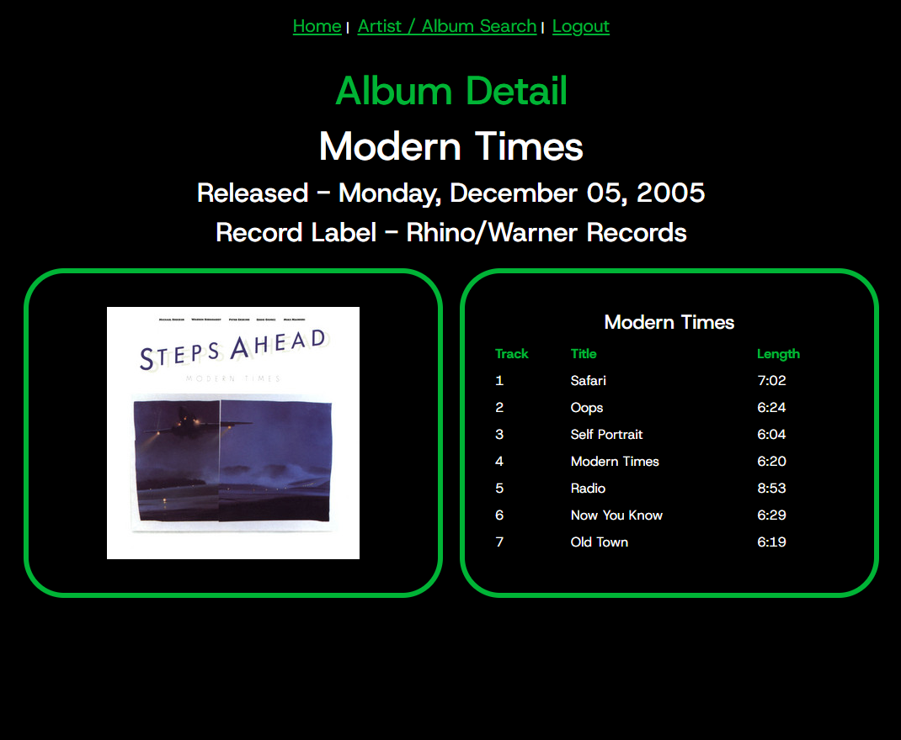

# Spotify API Services Experimentation
​
This is a full stack application
It utilizes the [spotify-web-api-java library](https://github.com/spotify-web-api-java/spotify-web-api-java)

It is the result of a continuing education course I am taking. We started out with a simple get Artist method, and I grew the code a bit more. I can currently display pertinent artist information (images, genres, etc) from a search query. I have also added a search query for Albums which will display important facts about an album (title, image, tracks, record label, recording date, etc)

## Sample Screenshot



## Personal Gains from This Project

During this project, I gained valuable insights into using the CSS `clamp()` function. This function allows text to dynamically resize based on the browser window's width, providing a smooth and responsive user experience. I found this particularly beneficial for maintaining consistent readability across various screen sizes, especially on mobile devices.

An example implementation of the `clamp()` function is as follows:
```css
font-size: clamp(1rem, 2vw, 2rem);

